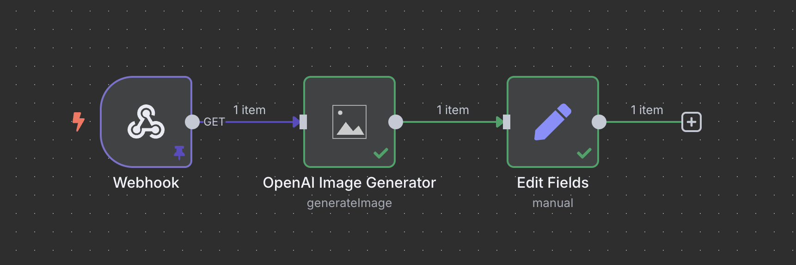

# OpenAI Image Generator - n8n Custom Node

This n8n community node integrates with OpenAI's image generation capabilities (DALL-E), allowing you to create AI-generated images directly within your n8n workflows.

## ✨ Features

- Generate images using OpenAI's DALL-E models
- Customize image parameters (size, quality, style)
- Support for multiple image variations
- Easy integration with other n8n nodes

## 🛠 Usage

1. Install the node via the **n8n Community Nodes** interface.
2. Configure your OpenAI API credentials.
3. Choose between generating new images or creating variations of existing ones.
4. Customize parameters and connect to other nodes to process or store the generated images.

## 🔑 Credentials

### OpenAI API

- **API Key**: Your OpenAI API key
- **Organization ID** (optional): Your OpenAI organization ID

## ⚙️ Node Parameters

### Generate Image

- **Prompt**: The text description of the image you want to generate
- **Model**: The DALL-E model to use (DALL-E 3, DALL-E 2)
- **Size**: Image size (1024x1024, 1024x1792, 1792x1024, etc.)
- **Quality**: Image quality (standard, hd)
- **Style**: Image style (vivid, natural)
- **Number of Images**: How many image variations to generate (1-10)
- **Response Format**: URL or Base64 JSON

### Create Image Variation

- **Image Binary Property**: The binary property containing the image to create variations of
- **Number of Variations**: How many variations to generate (1-10)
- **Size**: Image size (1024x1024, 512x512, 256x256)
- **Response Format**: URL or Base64 JSON

## 🖼 Example Workflow

The following example shows how to generate an image based on a text prompt and save it to a file:



1. **Webhook** – Starts the workflow.
2. **OpenAI Image Generator** – Generates an image based on a prompt.
   - Prompt: "A futuristic city with flying cars and neon lights"
   - Model: DALL-E 3
   - Size: 1024x1024
   - Quality: hd
   - Style: vivid
   - Number of Images: 1
3. **Edit Fields** – return the generated image.
   - url or b64_json
   - or both

## 🔁 Output

The node returns data in this format:

```json
{
	"created": 1589478378,
	"data": [
		{
			"url": "https://...",
			"b64_json": "..."
		}
	]
}
```

## 🧩 Tips

Use this node in combination with:

- The `HTTP Request` node to download the generated image
- The `Write Binary File` node to save the image locally
- The `S3` node to upload the image to cloud storage
- The `Telegram` or `Discord` nodes to share the generated images

---

For issues or feedback, please open an issue on GitHub.
